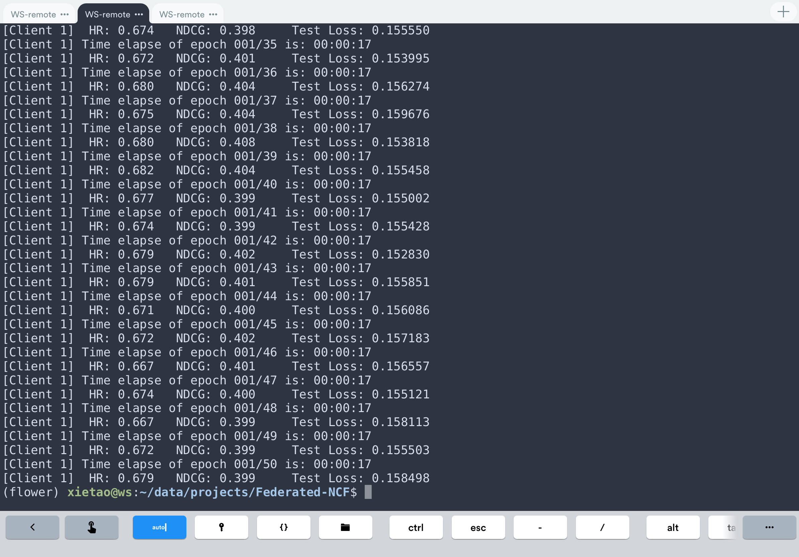

# Federated-NCF
Neural Collaborative Filtering based on Federated Learning, implemented using PyTorch.

## Requirements
 - flwr==1.5.0
 - torch==2.1.0
 - pandas==2.1.2
 - numpy==1.26.1

## How to Start
First, modify the content of the `config.py` file according to your requirements.
### Manually start the server and client
1. Server
```
python server.py
```
2. Client X (Int, for Client ID)
```
python client.py --cid 1
```
### Using the run.sh Script
Before usage, make sure to modify the contents of the `run.sh` file as needed.
```
./run.sh
```

## Result

Fderated Learning Result:
 - Best Round 31
 - HR = 0.6810730253353204
 - NDCG = 0.407131151183976



client 1 started by using `python client --cid 1`


cilent 2~9 started by using `run.sh`


## Reference
1. Xiangnan He, Lizi Liao, Hanwang Zhang, Liqiang Nie, Xia Hu and Tat-Seng Chua (2017). [Neural Collaborative Filtering.](http://dl.acm.org/citation.cfm?id=3052569) In Proceedings of WWW '17, Perth, Australia, April 03-07, 2017.
2. [Pythorch Version of Neural Collaborative Filtering at WWW'17](https://github.com/pyy0715/Neural-Collaborative-Filtering)